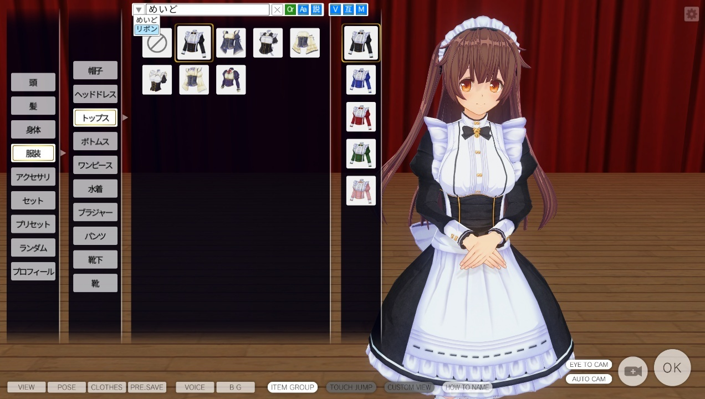

# CM3D2.EditMenuFilter.Plugin
CM3D2/COM3D2のエディットメニューのアイテムを名前や説明で絞り込みが出来るようにするプラグインです。

  

#### 使用方法  
  「UnityInjector」フォルダに「CM3D2.EditMenuFilter.Plugin.dll」を入れてください。  
  エディット画面のアイテムリスト上部にUIが表示される様になります。  

#### ボタンの説明
    「▼」  ：これまでに絞り込みを行った履歴から絞り込めます。  
    「×」  ：絞り込みを解除します。  
    「And」：And(青色)はスペースで区切った語句をすべて含むもののみ表示します。  
             Or(緑色)はスペースで区切った語句が一つでも含むもののみ表示します。  
    「Aa」 ：ON(青色)にすると「大文字小文字 / ひらがなカタカナ / 全角半角」を区別しません。  
            「めいど」で絞り込むと「メイド」や「ﾒｲﾄﾞ」でも引っかかります。  
    「説」 ：ON(青色)にするとアイテムの名前だけでなく説明文も検索します。(「アイテムリスト」「セット」のみ)  
    「名」 ：ON(青色)にするとプリセット名を表示します。(「プリセット」のみ)  
    「Ｖ」 ：ON(青色)にするとカスメ・オダメ本体のアイテムを表示します。
    「Ｍ」 ：ON(青色)にするとModアイテムを表示します。

#### コンフィグ
初回起動時に「UnityInjector\Config」フォルダに  

    「editmenufilter.xml」(アイテムリスト用)  
    「EditMenuFilter_Set.xml」(セット用)  
    「EditMenuFilter_Preset.xml」(プリセット用)  
が作られます。  
履歴や設定は「アイテムリスト」「セット」「プリセット」で個別に保存されます。  

    「HistoryMax」：履歴の最大数(デフォルト35)です。調整したい場合は書き換えてください。
    「IsAnd」     ：「And」「Or」ボタンの状態保存用です。
    「IgnoreCase」：「Aa」ボタンの状態保存用です。
    「FilterDesc」：「説」/「名」ボタンの状態保存用です。
    「History」   ：履歴の保存用です。履歴を消したい場合はこれを消してください。

#### 制限など
文字入力中でも他プラグインの起動キーに反応します…  
画面サイズによっては公式MODのUIに被るかもしれません。  

#### ライセンス
GitHubでのライセンスは一番緩そうな[MIT](https://github.com/Soul-chan/CM3D2.EditMenuFilter.Plugin/blob/master/LICENSE)ライセンスにしていますが、  
基本的なスタンスはこれまでの↓から変更はありません。  
改変、転載、ご自由にどうぞ。

    ※MODはKISSサポート対象外です。
    ※MODを利用するに当たり、問題が発生してもKISSは一切の責任を負いかねます。
    ※カスタムメイド3D2を購入されている方のみが利用できます。
    ※カスタムメイド3D2上で表示する目的以外の利用は禁止します。
    ※これらの事項は http://kisskiss.tv/kiss/diary.php?no=558 を優先します。
